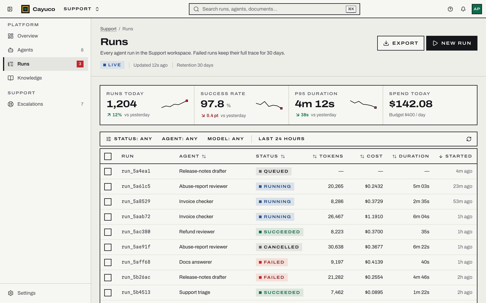
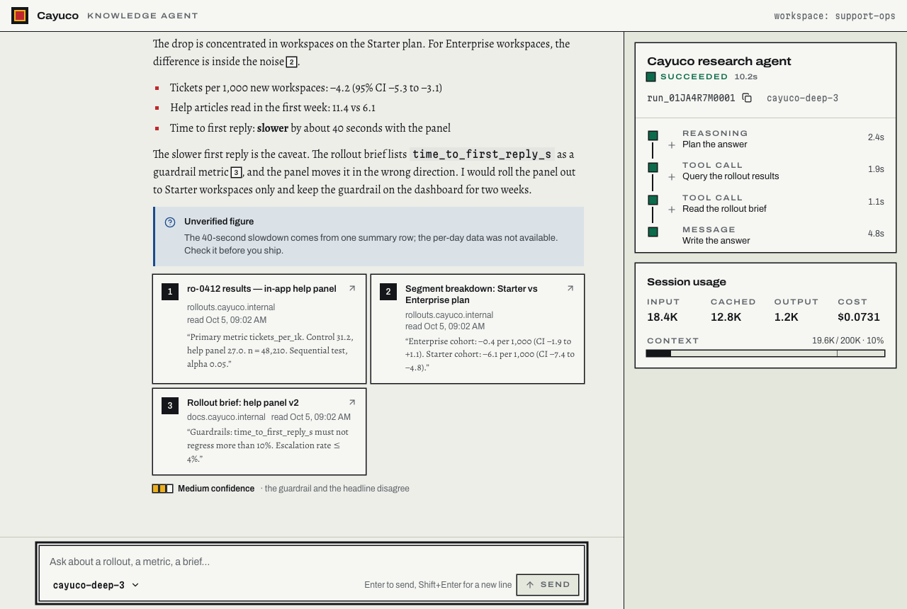
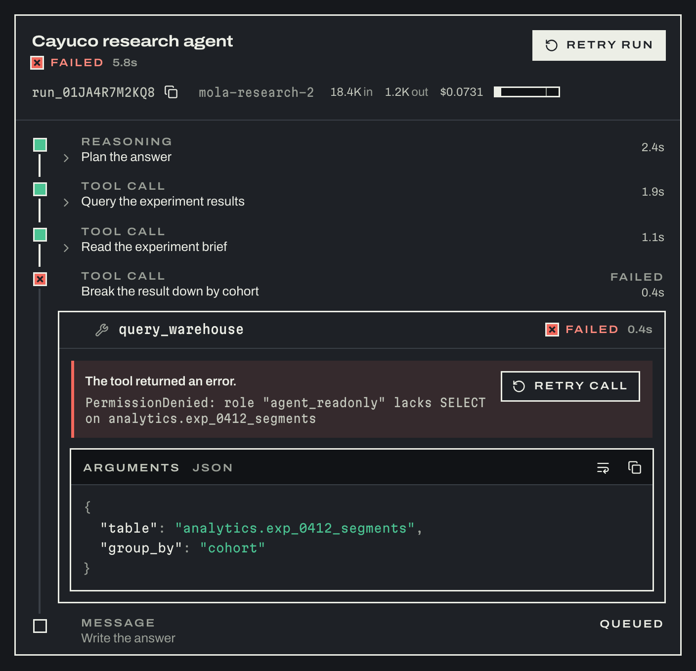
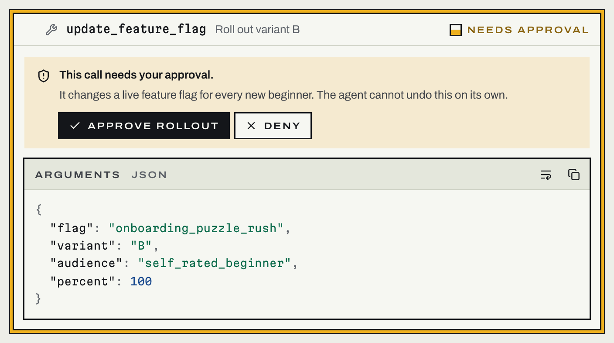
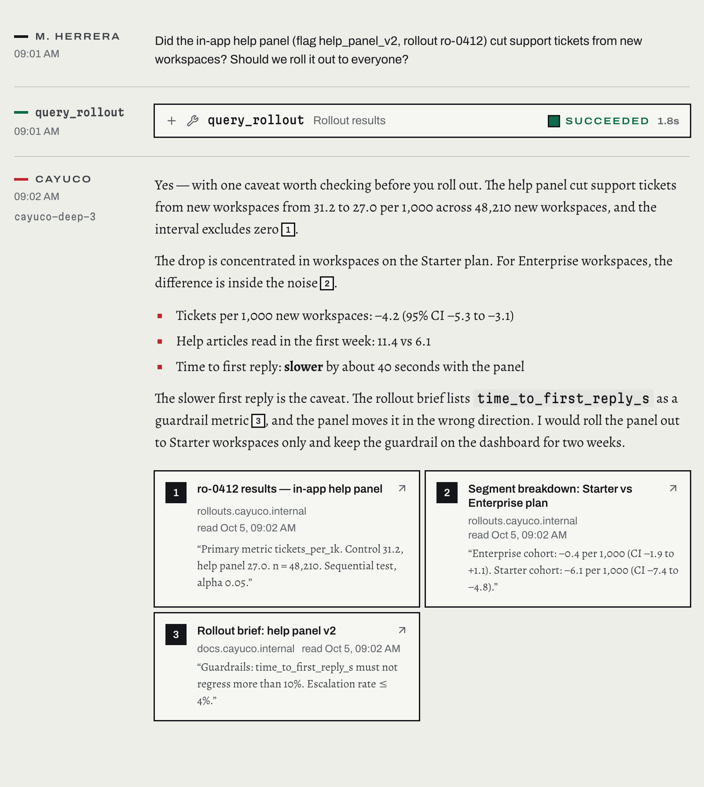
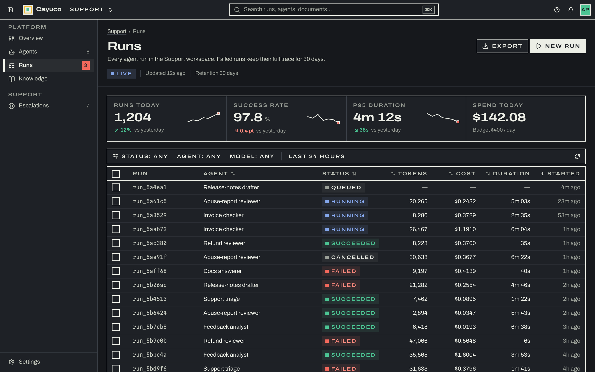
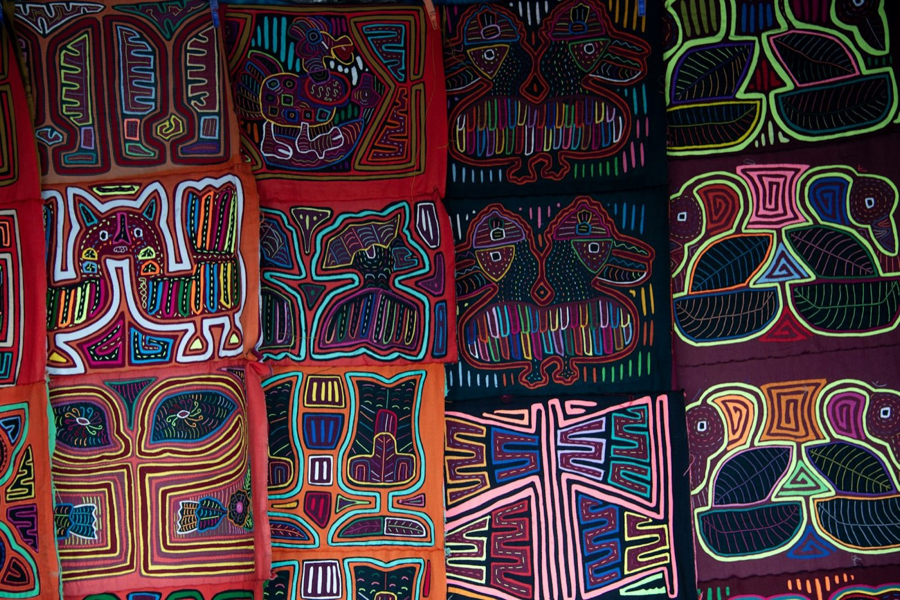

# Mola UI

**A design system cut like a mola: flat layers, hard keylines, revealed bands.**
React components and design tokens for dense internal tools and AI-native interfaces —
admin consoles, knowledge bases, agent run monitors — documented in a standalone Storybook.

**[Storybook →](https://demogar.github.io/molaui/)**



## What's inside

- **Tokens.** One CSS file. Two themes declared once with `light-dark()`, three densities on one
  attribute, zero radius. Every contrast pairing, 100+ of them across both themes, is computed
  from the CSS and enforced by a test. The tokens are exported to W3C design-token JSON for Figma.
- **53 components.** Actions, forms, overlays, feedback, navigation, data display and an
  application shell: 144 exported parts, built on [Base UI](https://base-ui.com) for behaviour and
  accessibility, and styled with Tailwind v4. Every one has a docs page that says when to use it,
  when not to and what to use instead.
- **An AI interface layer.** Streaming text, message threads, a composer whose send button becomes
  stop, tool-call cards with human approval, change review with diffs and a decision that needs a
  reason to say no, long-running agent run timelines with live elapsed time, run failure and
  recovery that keeps partial output, reasoning disclosure, citations that preview their source on
  hover, focus or tap, token budgets, and confidence stated in words rather than decimals.
- **Patterns.** Whole Cayuco screens composed only from the system, each with its decisions
  written down: a settings page with a save bar and unsaved-changes guard, a list and detail view
  that collapses to one column on a phone, and a filtered table of agent runs.
- **A working demo.** In the
  [agent console](https://demogar.github.io/molaui/?path=/story/ai-agent-console--console), ask a
  question and a simulated agent plans, calls two tools and streams a cited answer, with the run
  timeline and token usage updating beside it.



<table>
  <tr>
    <td width="50%" valign="top">
      <br>
      <sub><b>A failed agent run</b>, dark theme: the tool's error as a literal, and a retry scoped to the failed step.</sub>
    </td>
    <td width="50%" valign="top">
      <br>
      <sub><b>A tool call waiting for approval</b>, with its arguments shown as JSON and the reason it needs a person.</sub>
    </td>
  </tr>
  <tr>
    <td width="50%" valign="top">
      <br>
      <sub><b>A thread</b>: the question, a tool call, and the model's cited answer set in the reading face.</sub>
    </td>
    <td width="50%" valign="top">
      <br>
      <sub><b>The runs view</b> in the dark theme at compact density.</sub>
    </td>
  </tr>
</table>

## The name, and why we use it with care

A **mola** is the hand-sewn textile of the Guna people of Panama. The word names both the panels
and the blouse that Guna women make and wear. Two or more layers of cotton are basted together, a
design is cut through the upper layers, and every cut edge is turned under and hemmed by hand to
reveal the colour beneath. The technique is passed down from generation to generation, and a
single panel can take months to make.



<sub>Molas sewn by Guna women. Photograph by
[Maria Molino](https://unsplash.com/@mams_) on
[Unsplash](https://unsplash.com/photos/intricate-colorful-mola-textiles-with-traditional-designs-Y3V4qtRO5-Y).</sub>

A mola is more than decoration. In the early twentieth century Panama's government tried to stop
Guna women wearing their traditional dress. Making and wearing molas became an act of resistance,
and the Guna Revolution of 1925 won the Guna autonomy over their land and their culture. Today
the mola is protected under Panama's Law 20 of 2000 as collective intellectual property of the Guna
people.

**Mola UI is not made by Guna people and does not speak for them.** It carries the name out of
respect: to its author, the mola is one of the most authentic expressions of Panamanian culture,
and a craft that deserves to be honoured, not borrowed lightly. The name also fits what this
project tries to be. A mola carries a people's identity into everyday life. Each one is made by
hand and is unique, yet every one is recognisably part of the same tradition, because it comes from
a shared method. A design system does a humbler version of the same thing: it carries an identity
and the knowledge of how to make things well into every product, so each screen is its own while
plainly belonging to the same family.

What that respect means in practice:

- **We borrow the method, not the motifs.** Mola UI takes the grammar of the technique: stacked
  layers, hard cut edges, the revealed band. It reproduces no Guna designs, symbols or patterns in
  its interface. The photograph above is there only to show where the name comes from, credited
  to the women who make molas and to the photographer.
- **We claim no rights over the mola.** It belongs to the Guna people.
- **We name the source** wherever the name appears.
- **If you want a mola, buy one from Guna artisans**, so the craft supports the people who keep it
  alive.

## Why it looks like this

The mola's method is the system's grammar —

- **Every interactive edge is an ink keyline**, drawn with `box-shadow` so hover can *grow* a
  revealed band outward without moving a single neighbour.
- ***Relleno***, the filler slits of a mola, is the divider, the empty state, and — moving — the
  indeterminate "working" state of a long-running step.
- **Three typefaces, three speakers**: Archivo (on its width axis) for the system, Alegreya for
  prose a person or a model says to you, Martian Mono for machine literals. A transcript can be
  scanned for *what it said* versus *what it did* from the type alone.
- **State is never colour alone**: every status is a square mark, a word and a tone.

It began as the design system of [mustdopanama.com](https://www.mustdopanama.com), an editorial
travel guide, and was carried into product software — the same identity, re-argued for
information density, all-day dark mode and the states AI work produces. The decisions are written
down in [`docs/adr/`](docs/adr/).

## Quick start

```bash
npm install @demogar/mola-ui @base-ui/react \
  @fontsource-variable/archivo @fontsource-variable/alegreya @fontsource-variable/martian-mono
```

```tsx
import '@fontsource-variable/archivo/wdth.css'
import '@fontsource-variable/alegreya/wght.css'
import '@fontsource-variable/martian-mono/wdth.css'
import '@demogar/mola-ui/styles.css'

import { ToolCall } from '@demogar/mola-ui'

<main data-theme="dark" data-density="compact">
  <ToolCall
    name="update_feature_flag"
    status="waiting"
    args={{ flag: 'onboarding_v3', percent: 100 }}
    approval={{
      reason: 'Changes a live flag for every new player.',
      onApprove: approve,
      onDeny: deny,
    }}
  />
</main>
```

Already on Tailwind v4? Import `@demogar/mola-ui/tailwind.css` into your own build instead. Not on React?
`@demogar/mola-ui/tokens.css` is plain custom properties — both themes and all densities work anywhere.
Designing in Figma? Load [`tokens/mola.tokens.json`](tokens/mola.tokens.json) with Tokens Studio.

## For AI agents

Mola UI documents itself for coding agents as well as for people, from the same source:

- **[`llms.txt`](llms.txt)** and **[`llms-full.txt`](llms-full.txt)**, also served from the
  [Storybook root](https://demogar.github.io/molaui/llms.txt): the rules, installation and every
  component with its guidance and props, in the [llms.txt](https://llmstxt.org) format.
- **[`docs/ai/components.json`](docs/ai/components.json)**: every export with its props, types,
  defaults, doc comments, cva variants, usage guidance and story links.
- **[`skills/mola-ui/SKILL.md`](skills/mola-ui/SKILL.md)**: a Claude Code skill that teaches an
  agent the rules, which component to pick and how to use the tokens. Copy the folder into
  `.claude/skills/` in your project.

The manifest and both text files are generated by `npm run manifest` from the TypeScript source
and the stories, and CI fails if they are stale, so an agent never builds from a prop list that
no longer compiles.

## How quality is held

```bash
npm run check   # lint · typecheck · test · tokens:check · manifest:check · build · build-storybook
```

- **The contrast contract** (`src/tokens/contract.test.ts`) resolves every token in both themes —
  `light-dark()`, `var()`, OKLab `color-mix()` — and asserts each promised pairing. It caught a real
  dark-theme failure during the build (muted ink on the gold wash, 4.00:1) before any screen did.
- **No hex outside `tokens.css`**, enforced by a test.
- **Every story is a test**: all 274 stories render through the real Storybook config and pass axe
  in the unit suite; `scripts/audit.mjs` re-runs axe *with colour contrast* in a real browser in both
  themes, and checks every story for horizontal overflow at 390px.
- **Docs can't drift from the code.** The design-token JSON and the agent manifest are generated
  and checked in CI; the component counts in this README are checked against the source; and a
  test resolves every link into Storybook, so a renamed story fails the build instead of a reader.
- **`tailwind-merge` knows the token vocabulary**, with a test that fails if a new colour token is
  not registered — the silent class-dropping bug this prevents shipped in the system's first home.

## Repository map

```
src/styles/      tokens.css (the only file with hex) · theme.css (Tailwind bridge) · cloth.css (the mola utilities)
src/components/  one folder per component: component, stories, tests, barrel
src/components/ai/  the AI interface layer
src/patterns/    whole screens composed from the system (Storybook only, not in the package)
src/tokens/      colour math + the contrast contract
src/docs/        Storybook docs: introduction, principles, foundations, usage guidance, versioning
tokens/          generated DTCG tokens for Figma
docs/ai/         generated component manifest for agents
docs/adr/        architecture decision records
codemods/        scripts that migrate consumer code across breaking changes
skills/mola-ui/  the Claude Code skill
```

## References

Mola UI's identity, tokens and components are its own. How it is built, run and presented draws on
Dan Mall's [*Design That Scales*](https://rosenfeldmedia.com/books/design-that-scales/) (Rosenfeld
Media, 2023). From the book it takes these practices: grow the system out of real product work
rather than designing it in the abstract; keep it a connected, versioned dependency rather than
code to copy; show what it builds before its parts; and admit a component only when three use
cases need it. The [References](https://demogar.github.io/molaui/?path=/docs/mola-ui-references--overview)
page in Storybook maps each idea to where it applies, and lists the standards the system follows:
WCAG 2.2, the W3C Design Tokens format and Conventional Commits.

## Contributing

Read [CONTRIBUTING.md](CONTRIBUTING.md) for the gates, the rules a review holds you to, and how
releases are cut. Everyone taking part follows the [Code of Conduct](CODE_OF_CONDUCT.md). Report
security issues privately, as described in [SECURITY.md](SECURITY.md). Changes are listed in the
[changelog](CHANGELOG.md).

## Credits

Designed, architected and directed by Demóstenes García. Built with
[Claude Code](https://claude.com/claude-code).

The mola is the textile art of the Guna people; this project borrows its method, not its motifs. Typefaces: Archivo (Omnibus-Type), Alegreya (Juan Pablo del Peral, Huerta
Tipográfica), Martian Mono (Evil Martians) — all under the SIL Open Font License.

[MIT licensed](LICENSE).
